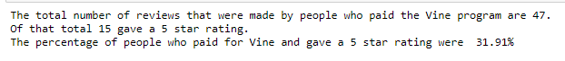
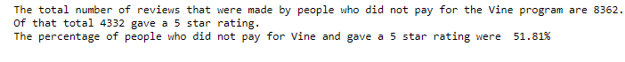

# Amazon_Vine_Analysis

## Overview of the Analysis

In this analysis I took Amazon reviews written by people who have paid the Amazon Vine program. I used AWS and downloaded the file into Pyspark. Using the ETL process I created 4 new data frames. After, loading it into our PgAdmin and loaded them into our PostgreSQL database. Using PgAdmin I created a csv file of the vine table. Then, I read the csv file through Pandas and created more analysis to see if the amount 5-star reviews are different between people who have paid for vine and who did not.

## Results
### Review statistics for People who were vine reviews:

### Review Statistics for People who were not vine reviews:

  - In the images above, we can see that the total number of reviews of people how are Vine reviews are 47; and of those 47 there are 15 of them that are 5-star reviews. Also, we can see that there are a total of 8362 reviews of non-Vine reviews; and of that total 4332 gave a 5-star rating.
  
  - The percentage of Vine reviews that were 5 stars was 31.91%. The percentage of non-Vine reviews that gave a 5-star rating was 51.81%

## Summary

Looking at our statistics we see that there is a positivity bias for reviews that come from non-Vine customers. This is shown by non-Vine reviews having 51.81% 5-star reviews vs 31.91% 5-star reviews for people in the Vine subscription. We can also create the opposite type of analysis and see the percentage reviews that are 1 star. We can see there is a bigger percentage of 1-star reviews for Vine reviews vs non-Vine reviews.
